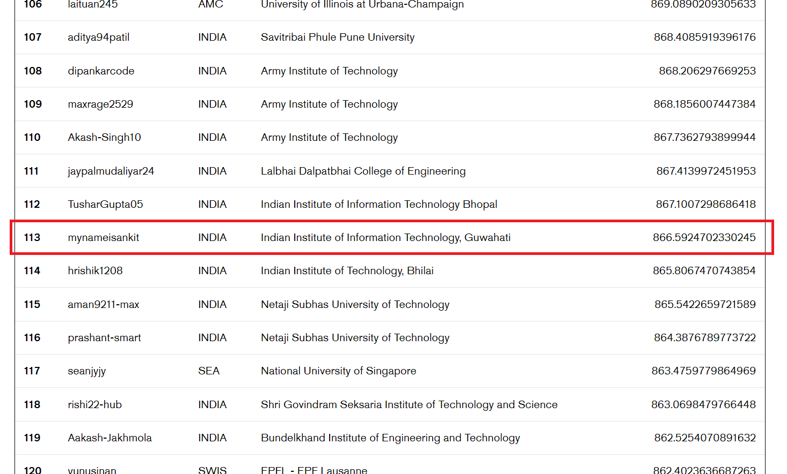

# Credit Suisse Global Coding Challenge 2022 #

This repository contains the solutions of the nine questions 2022 Credit Suisse Global Coding Challenge.

All the solutions are implemented in C++ prorgamming language.

## Table of Contents ##
- [Results](#results)
- [Question set](#question_set)

## 🏆 Results  ##
113th place on the global leaderboard with 866 points

    

## 🎓 Question set 

- [Question 1](./Question1/readme.md)
- [Question 2](./Question2/readme.md)
- [Question 3](./Question3/readme.md)
- [Question 4](./Question4/readme.md)
- [Question 5](./Question5/readme.md)
- [Question 6](./Question6/readme.md)
- [Question 7](./Question7/readme.md)
- [Question 8](./Question8/readme.md)
- [Question 9](./Question9/readme.md)
